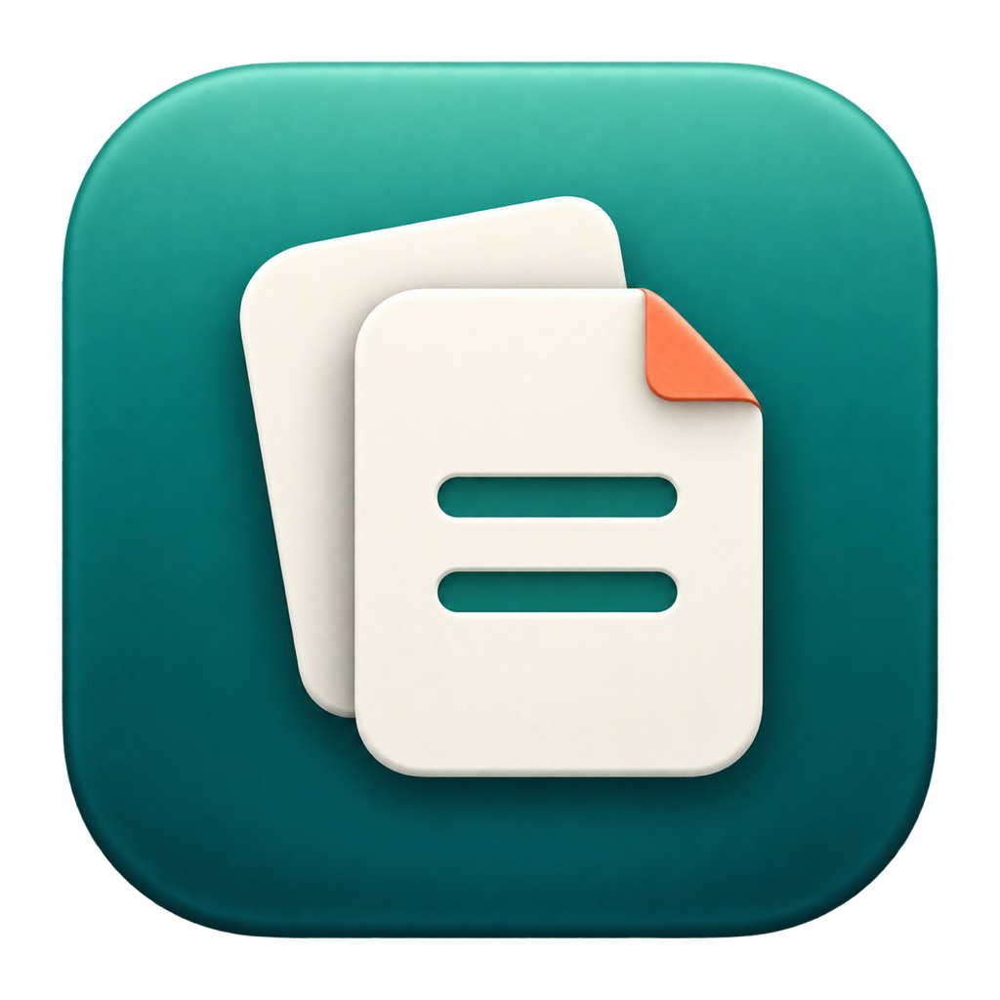
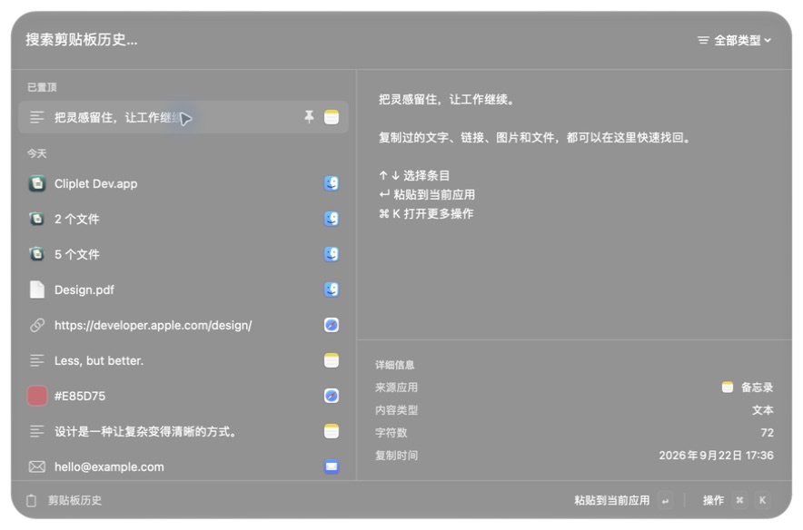
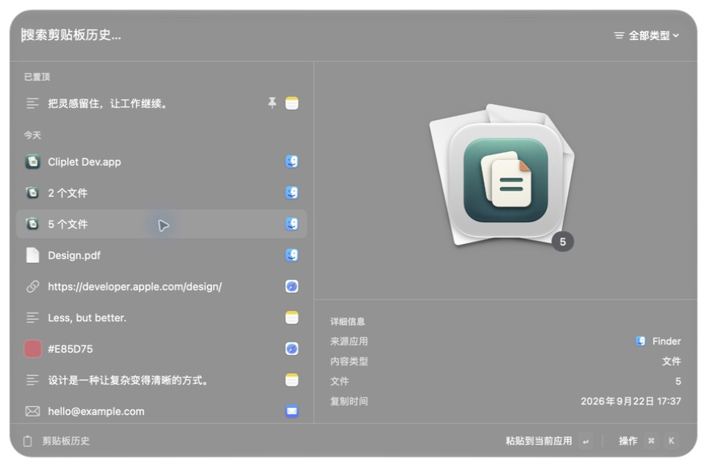
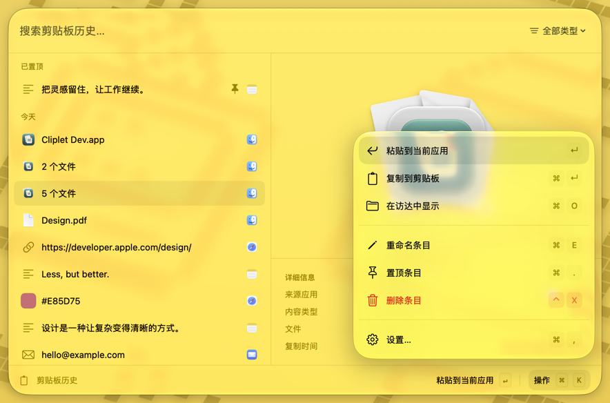
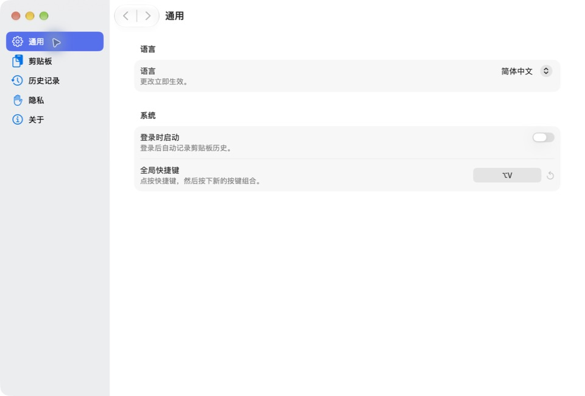

<p align="center">
  
</p>

<h1 align="center">Cliplet · 拾片 — macOS 剪贴板管理器</h1>

<p align="center">简体中文 · <a href="README.en.md">English</a></p>

<p align="center">轻量、开源的 Mac 剪贴板历史工具 · Native macOS Clipboard Manager<br>保存复制历史，快速搜索，在需要时再次粘贴。</p>

<p align="center">
  <a href="https://github.com/xgenya/cliplet/actions/workflows/ci.yml"></a>
  
  
  <a href="LICENSE"></a>
</p>

<p align="center">
  <a href="#为什么做-cliplet">项目缘起</a> ·
  <a href="#设计理念">设计理念</a> ·
  <a href="#安装">安装</a> ·
  <a href="#使用">使用</a> ·
  <a href="#开发">开发</a> ·
  <a href="CONTRIBUTING.md">参与贡献</a> ·
  <a href="CHANGELOG.md">更新记录</a>
</p>

Cliplet（拾片）是一款免费开源的 **macOS 剪贴板管理器（clipboard manager）**，用于保存和搜索**剪贴板历史（clipboard history）**，也就是常说的“Mac 剪切板工具”或“复制粘贴历史工具”。使用 SwiftUI 和 AppKit 构建，常驻菜单栏。按下 **⌥V** 即可查看复制过的文本、链接、图片和文件，搜索后直接粘贴到当前应用。无需账号，历史记录保存在本机。

**专注剪贴板，无第三方依赖，体积小巧。** 从记录、搜索到再次粘贴，功能围绕复制内容的复用展开。应用使用 macOS 系统框架，无需额外安装运行时或后台服务。



## 为什么做 Cliplet？

这个项目源于一个简单的需求：**喜欢 Raycast 的剪贴板功能，但只想用剪贴板。**

Cliplet 参考了 Raycast Clipboard History 的使用体验，将快捷键呼出、搜索历史、预览和再次粘贴这些操作放进一个独立、轻量的 macOS 应用。如果你正在寻找 **Raycast 剪贴板功能的开源替代工具**，希望只安装一个专注复制粘贴历史的应用，这正是 Cliplet 的出发点。

Cliplet 是独立项目，与 Raycast 无隶属关系。这里的参考指使用体验；项目使用 Swift 和 Apple 原生框架实现。

## 功能

- **剪贴板历史**：记录文本、链接、邮箱、颜色、图片、文件及 RTF / HTML 富文本，自动去重并按时间分组。
- **搜索与整理**：搜索内容、按类型筛选，为常用条目置顶或重命名。
- **内容预览**：查看图片、文件预览、来源应用和条目详情。
- **键盘操作**：通过全局快捷键打开历史，使用方向键选择条目，通过操作面板执行更多操作。
- **图片识别**：使用 Apple Vision 在本机识别图片中的文字和二维码，支持搜索和复制识别结果。
- **记录控制**：暂停记录、排除指定应用，设置保留期限、数量上限和登录启动。
- **原生界面**：支持中文、英文及浅色、深色外观；macOS 26+ 使用 Liquid Glass，较旧系统使用原生材质回退。

<details>
<summary>更多截图</summary>

| 文件预览 | 快捷操作 |
| :---: | :---: |
|  |  |



</details>

截图使用隔离演示模式中的合成数据。界面材质会随 macOS 版本、系统外观和桌面背景变化。

## 设计理念

“拾片”意为拾回复制过的片段。Cliplet 希望让这些临时内容成为随时可取用的工作素材，让查找与复用自然地接在复制之后。

- **专注剪贴板**：围绕记录、查找、整理和复用复制内容完善体验，让每个功能都服务于这条简单的工作流。
- **轻量且无第三方依赖**：使用 Swift 与系统框架实现界面、存储和图片识别，没有第三方 Swift 包依赖，也不打包浏览器运行时。本地 Release 应用包的磁盘占用约为 **5.5 MiB**（`du -sh build/Cliplet.app` 实测；仅指应用本身，不含历史数据，大小随构建变化）。
- **减少打断**：平时常驻菜单栏，需要时通过快捷键呼出；搜索、选择、粘贴围绕一个紧凑的浮动窗口完成，尽快回到原来的工作。
- **内容优先**：以内容摘要和预览帮助辨认条目，用来源、类型和时间补充上下文。视觉层级服务于查找，常用操作可直接通过键盘完成。
- **融入 macOS**：使用 SwiftUI、AppKit 和系统原生控件，遵循熟悉的窗口、菜单与快捷键习惯，让外观随系统演进。
- **本地与可控**：历史存储和图片识别在本机完成；记录范围、保留期限和暂停状态由用户控制。保持功能集中，也让实现便于理解和维护。

### 液态玻璃 · Liquid Glass

在 macOS 26 及更新版本上，Cliplet 使用系统原生 Liquid Glass 呈现历史窗口和快捷操作面板。半透明材质让浮层保留桌面与当前应用的背景关系，配合圆角、边缘与层次感，区分临时操作界面和背后的工作内容。

玻璃材质主要承载窗口与操作层，文本、图片和列表内容保持清晰的阅读层级。设计上优先保证内容辨识与操作效率，并控制材质叠加，让玻璃效果与紧凑的剪贴板工作流协调。

历史窗口通过 AppKit 的 `NSGlassEffectView` 实现，快捷操作面板使用 SwiftUI 的 `glassEffect`。在 macOS 14–15 上，两者回退为 `NSVisualEffectView` 原生材质，保留相同的核心功能与操作流程。实际材质表现由系统渲染，会随浅色 / 深色外观和背景变化。

## 安装

### 系统要求

| 项目 | 要求 |
| --- | --- |
| 系统 | macOS 14 或更新版本 |
| 硬件 | Apple Silicon Mac（M1 及更新机型），不支持 Intel Mac |
| 构建工具 | Xcode 26+，包含 Swift 6.2+ 和命令行工具 |

### 从源码构建

项目使用 Swift Package Manager，无第三方 Swift 包依赖。在已安装上述工具的 Mac 上运行：

```bash
git clone https://github.com/xgenya/cliplet.git
cd cliplet
make app
open build/Cliplet.app
```

构建产物为 `build/Cliplet.app`，可将其复制到“应用程序”目录。本地构建默认使用 ad-hoc 签名，不需要 Apple Developer 证书，也不会自动进行 Apple 公证。

## 使用

1. 启动 Cliplet，应用会常驻菜单栏并记录后续复制的内容。
2. 在任意应用中按 **⌥V** 打开历史窗口，也可以通过菜单栏打开。
3. 输入关键词搜索，使用 **↑ / ↓** 选择条目，按 **↩** 粘贴。
4. 对于常用内容，按 **⌘K** 打开操作面板，置顶或重命名条目。

自动粘贴需要在「系统设置 → 隐私与安全性 → 辅助功能」中授权 Cliplet。未授权时仍可使用 **⌘↩** 将条目复制到剪贴板，再回到目标应用按 **⌘V** 手动粘贴。

全局快捷键、应用排除规则和历史保留策略均可在 Cliplet 设置中调整。

### 快捷键

除全局快捷键外，以下操作在历史窗口中使用。

| 快捷键 | 操作 |
| --- | --- |
| `⌥V` | 显示 / 隐藏历史窗口，可在设置中自定义 |
| `↑` / `↓` | 选择条目 |
| `↩` | 粘贴选中条目 |
| `⌘↩` | 仅复制到剪贴板 |
| `⌘K` | 打开 / 关闭操作面板 |
| `⌘.` | 置顶 / 取消置顶 |
| `⌘E` | 重命名 |
| `⌘O` | 打开链接 / 在访达中显示文件 |
| `⌃X` | 删除选中条目 |
| `⌘P` | 切换内容类型 |
| `Esc` | 关闭操作面板或历史窗口 |

## 隐私与数据

Cliplet 不上传剪贴板内容，不提供云同步。图片文字与二维码识别均在设备上完成。

默认排除 Apple Passwords、钥匙串访问、1Password、Bitwarden 和 LastPass，并跳过带受支持敏感类型标记的剪贴板数据。你可以在设置中添加排除应用，也可以随时暂停记录。排除规则无法识别所有敏感内容。

正式版历史元数据和附件保存在：

```text
~/Library/Application Support/Cliplet/
```

**历史文件未单独加密。** 请根据需要设置保留期限和数量上限，及时删除不应保留的内容。

从旧版升级时，应用会尝试迁移 `~/Library/Application Support/ClipboardNative/` 中的数据；迁移失败时继续使用旧目录。

## 开发

项目以 Swift package 组织，可以用 Xcode 打开 `Package.swift`，也可以通过命令行构建。开发版使用独立的应用身份和数据目录。

```bash
make dev-app
open "build/Cliplet Dev.app"
```

常用命令：

| 命令 | 用途 |
| --- | --- |
| `make build` | 构建 Debug 可执行文件 |
| `make format` | 格式化 Swift 源码 |
| `make check` | 运行格式检查、仓库检查和回归测试 |
| `make package-test` | 构建应用并检查打包、移动后的启动行为 |
| `make performance` | 运行 Release 模式性能测试 |
| `make app` | 构建并打包 Release 应用 |
| `make run-app` / `make run-dev-app` | 构建并启动应用，自动替换正在运行的旧版本 |

仅调试界面时，可使用演示模式。该模式使用合成数据，不读取真实历史，也不监听系统剪贴板：

```bash
"build/Cliplet Dev.app/Contents/MacOS/Cliplet" --ui-preview --light
# 预览设置窗口：追加 --settings-preview
```

### 项目结构

```text
Sources/Cliplet/      # 可执行入口，仅包含 main.swift
Sources/ClipletKit/
├── Animation/    # 面板打开动画预设与播放
├── App/          # 应用生命周期、窗口和依赖组装
├── Domain/       # 历史保留、排序与搜索规则
├── Models/       # 剪贴板条目模型
├── Persistence/  # 历史与附件存储、数据迁移
├── Services/     # 剪贴板监听、识别、快捷键与粘贴
├── UI/           # SwiftUI 视图与展示逻辑
└── Resources/    # 图标和本地化资源
Tests/            # 回归与性能测试
scripts/          # 构建、打包与检查脚本
```

CI 执行格式检查、回归测试、arm64 应用打包和性能测试，并在 macOS 14 上检查打包产物能否启动。

## 参与贡献

欢迎提交 Bug、功能建议、文档改进和代码贡献。

- **报告问题**：通过 [Issues](https://github.com/xgenya/cliplet/issues) 提供 macOS 版本、复现步骤、预期与实际行为；截图请移除私人内容。
- **提交代码**：阅读 [贡献指南](CONTRIBUTING.md)，提交前运行 `make format` 和 `make check`。打包或资源变更还需运行 `make package-test`。
- **了解项目**：查看 [架构说明](docs/ARCHITECTURE.md)、[路线图](docs/ROADMAP.md) 和 [更新记录](CHANGELOG.md)。

请勿在 Issue、日志、测试数据或提交记录中包含真实剪贴板内容。

## 许可证

Cliplet 基于 [MIT License](LICENSE) 开源。

Copyright © 2026 Cliplet contributors.
