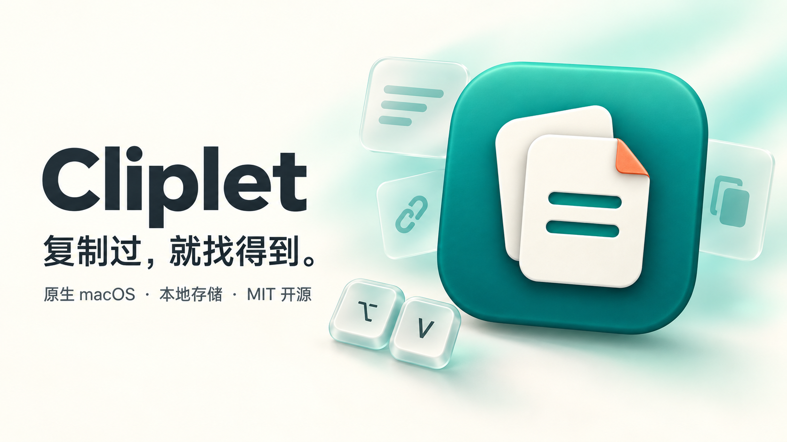

<p align="center">
  
</p>

<h1 align="center">Cliplet · 拾片</h1>

<p align="center">复制过，就找得到。<br>A native, local-first clipboard manager for macOS.</p>

<p align="center">
  <a href="https://github.com/xgenya/cliplet/actions/workflows/ci.yml"></a>
  
  
  <a href="LICENSE"></a>
</p>



按下 **⌥V**，找回刚才复制的文字、链接、图片或文件。搜索、预览、置顶，再粘贴到正在工作的应用。Cliplet 使用 SwiftUI 与 AppKit 构建，常驻菜单栏，不需要注册账号。

## 功能

- **随手找回** — 自动记录、内容去重、按时间分组，支持全文搜索和类型筛选。
- **不止文字** — 文本、链接、邮箱、颜色、图片、文件，以及 RTF / HTML 富文本。
- **看清再粘贴** — 图片预览、文件图标叠放、来源应用和详细信息。
- **键盘优先** — 全局快捷键、方向键导航和快捷操作面板，常用内容可以置顶、重命名。
- **本机识别** — 使用 Apple Vision 识别图片中的文字与二维码，识别结果可搜索、可复制。
- **原生外观** — 浅色与深色、中文与英文；macOS 26+ 使用 Liquid Glass，较旧系统保留原生材质回退。
- **由你控制** — 暂停记录、排除应用、保留期限、数量上限与登录启动。

## 界面

以下截图来自应用的隔离演示模式，使用合成数据。玻璃材质会随系统版本、外观和桌面背景变化。

| 剪贴板历史 | 文件叠放预览 |
| :---: | :---: |
|  |  |
| 快捷操作 | 原生设置 |
|  |  |

## 安装与构建

当前提供源码构建。运行需要 **macOS 14 或更新版本**；构建需要 **Xcode 26+（Swift 6.2+）** 和命令行工具，无第三方 Swift 包依赖。

```bash
git clone https://github.com/xgenya/cliplet.git
cd cliplet
make app
open build/Cliplet.app
```

生成的应用位于 `build/Cliplet.app`，可以复制到“应用程序”目录。默认构建适配当前 Mac；同时构建 Apple Silicon 与 Intel 版本：

```bash
UNIVERSAL=1 make app
```

Cliplet 常驻菜单栏。按 **⌥V** 或从菜单栏打开历史窗口，全局快捷键可以在设置中修改。自动粘贴需要辅助功能权限；未授权时仍可复制条目，再手动按 **⌘V** 粘贴。

> 本地构建使用 ad-hoc 签名，不等同于经过 Apple 公证的发行包。

## 快捷键

| 快捷键 | 操作 |
| --- | --- |
| `⌥V` | 显示 / 隐藏剪贴板历史，可自定义 |
| `↑` / `↓` | 选择条目 |
| `↩` | 粘贴选中条目 |
| `⌘↩` | 仅复制到剪贴板 |
| `⌘K` | 打开 / 关闭操作面板 |
| `⌘.` | 置顶 / 取消置顶 |
| `⌘E` | 重命名 |
| `⌘O` | 打开链接 / 在访达中显示文件 |
| `⌃X` | 删除选中条目 |
| `⌘P` | 切换内容类型 |
| `Esc` | 关闭操作面板或历史窗口 |

## 隐私

历史记录保存在本机，不提供云同步，也不上传剪贴板内容。图片文字与二维码识别在设备上完成。默认排除 Apple Passwords、钥匙串访问、1Password、Bitwarden 和 LastPass，并跳过带受支持敏感类型标记的剪贴板数据；你也可以添加排除应用或暂停记录。

正式版数据位于 `~/Library/Application Support/ClipboardNative/`，包含历史元数据和附件。**历史文件未单独加密**，请按需设置保留期限，避免保存敏感内容。排除规则不保证识别所有来源的秘密信息。

## 参与开发

欢迎通过 [Issues](https://github.com/xgenya/cliplet/issues) 提交问题和建议，或发起 Pull Request。反馈界面问题时，请附上 macOS 版本、复现步骤和不含私人内容的截图。

```bash
make dev-app      # 独立的 Cliplet Dev 应用和数据目录
make check        # 格式检查、仓库检查与回归测试
make package-test # 打包、迁移位置与启动检查
make performance  # Release 模式性能测量
```

需要拍摄界面或调试样式时，可使用不读取真实历史、不监听剪贴板的演示模式：

```bash
"build/Cliplet Dev.app/Contents/MacOS/ClipboardNative" --ui-preview --light
# 设置窗口：再添加 --settings-preview
```

提交前请运行 `make format` 和 `make check`。CI 会构建 Universal 应用，并执行最低支持系统上的打包启动检查。

## 许可证

[MIT](LICENSE) © Cliplet contributors。欢迎使用、修改和分发。
